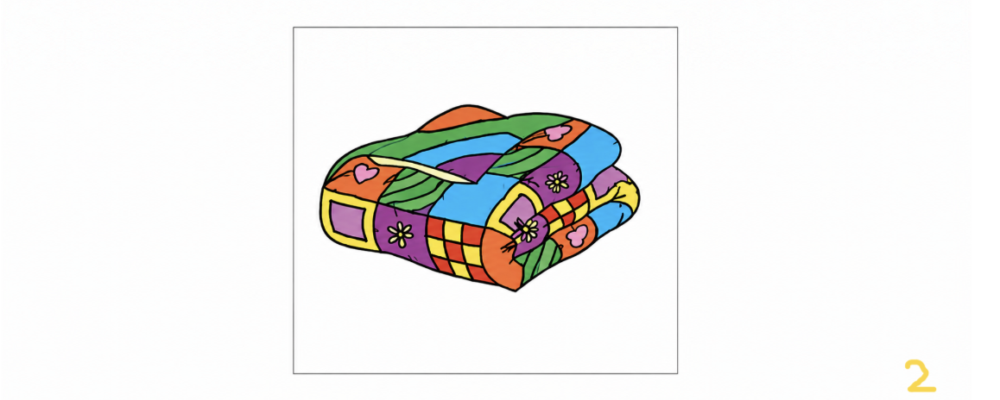

# Level Text
++++++++++ [ > + > +++ > +++++++ > ++++++++++ <<<< - ] >> +++++++++++++++++++ . ++ . - . ------------------ . > ++++++++++ . --------------- . ++++++++++++ . < . >> ----------- . < +++++ . ------------- . > --- . < . < . >> -------- . + . << . >> ++++ . - . < . > -- . < ++++ . > -- . +++++ . << . > - . > + . < + . > +++ . << . > ---- . > --- . < ---- . > ------ . ----- . ++++ . ++ . < +++ . < . >> . +++++ . << . >> +++ . -------- . < ++++ . < . < . 

## Source Code Hint
Burbn

## Answer
technobladeneverdies

## Walkthrough
* Lvl text is brainfuck language 
* Text you get after decoding it is
> 132 PAM YREVE NO SREPINS HTIW ETANIMOD OT WOH 

* After reversing the text you will get - How to dominate with snipers in every map 231(you need to change it to time format so 2:31)
* After searching this on youtube you will get a [video of RuFFles](https://youtu.be/2-9q4YpVC48?si=hrqTkmVY-4qsl-YS&t=151) 
* On 2:31 of the video you will get ‘Godlike’ on the screen
* /godlike is a backlink on the main website
* The backlink gives 
* 
* The image can be decrypted using Steganocrypt to get a maze
* After solving the maze you will get the word “1widen” in its path and ‘quilt2’ from the cover image
* From techsyndicate.club(the official website of TS in 2021) you will get the Robotronic post of 2021 in instagram(from Burbn)
* From the post you will get the hint - https://bit.ly/tshuihuihui
* This will lead to [this](media/Document%20(1).docx)
* The cipher is voynich manuscript which gives - Snackingthree
* The order is given by the number written on the images(widen:1;quilt:2;snacking:3;)
* By combining the words- widen.quilt.snacking 
* You will get what3words of bermuda island
* Capital of bermuda island is hamilton
* This will lead to lewis hamilton
* The photo is from an interview where mike davis share how halo saved his life
* After relating that with lewis hamilton you will get the incident that happened in 2021 Italian Grand Prix at Monza 
* The winner of the 2021 Italian Grand Prix at Monza was Mclaren
* /mclaren is also a backlink on the main website which gives
> https://www.dropbox.com/scl/fi/bxh39g9uiv7mq60785nmg/spectrotraceaudio.wav?rlkey=ol4a05nn3t4wymg1oqowp8oed&st=373m61t9&dl=0
  მტრების დასაბნევად, პირველ რიგში, საკუთარი თავი უნდა დააბნიო.
* The georgian language will decode to “To confuse your enemies, first of all, you have to confuse yourself” hinting at the famous meme quote -  “to confuse your enemies, you must first confuse yourself”)
* The spectogram will give a pastebin backlink – [DxBHNYSX](https://pastebin.com/DxBHNYSX) of pastebin
* From the pastebin you will have to check the account and go to the other post of the same account
* The password for the pastebin is ‘suntzu’ whom the quote is attributed too
* From the other paste  you will get a [google docs link](https://docs.google.com/document/d/1uZhGhjDQSxzs-DKrmAmLTBGvZLqpLb1MkB4qUEDoudg/edit?tab=t.0) which will have hidden text in base65535
* After decoding it, we get
> No hammer strikes, yet mountains fall, No architect, yet cities crawl. A world of cubes beneath the sun, Where night brings foes you cannot outrun. Dig where darkness hides its prize, Build where your imagination lies. With nothing but your hands to start, Turn scattered blocks into your art.
* Refers to minecraft
* From taking the account name from the earlier paste(ie- piggyking1)will lead  to Technoblade
* Answer is ‘technobladeneverdies’

*Writeup written by Jai Dugal*
