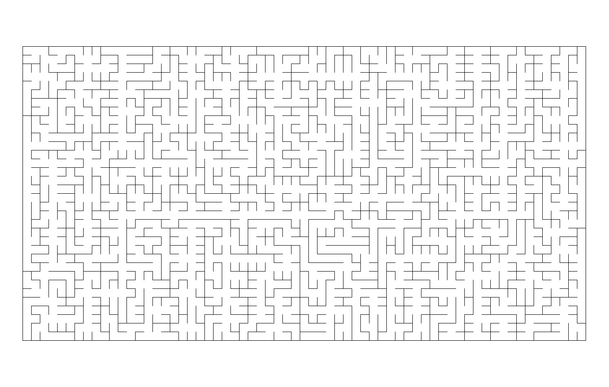
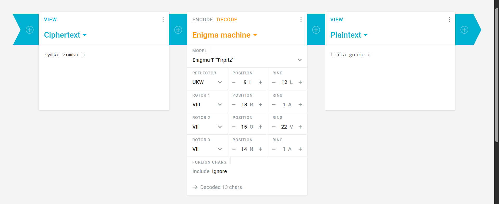

# Level Text

I am what the gods have made me

## Answer

internationaldaytoendobstetricfistula

## Walkthrough

- Level text includes a dialogue said by Kratos in GOW2 => Voice actor of Kratos in GOW2 is Christopher Judge.
- /christopherjudge has the [following contents](https://drive.google.com/file/d/1IgpRCk8jqJYtNxNwQHq21SzqxwOyZZdR/view?usp=sharing)
- The image in this has a wire and "+ d" written in the foreground => Wired, and a flag of Italy in the background => **Wired Italy** is related.
- The title of the image is a [youtube backlink](https://www.youtube.com/watch?v=NYtEKPEs0v8)
- Title of the video => Sleeping Beauty - Once Upon a Dream ( Italian ) HD
- Comment of bhavitgrover on this video => focus on the voice, not the video => giving a hint to find out the voice actor of the princess in the sleeping beauty Italian dub. => **Maria Pia De Meo**
- Combine **Maria Pia De Meo** and **Wired Italy** to get a wired article about [**Devil Wears Prada 2** ](https://www.wired.com/story/the-italian-dubbing-of-the-devil-wears-prada-2-has-stirred-up-a-surprising-controversy/)
- Go to _bit.ly/devilwearspradatwo_ to find out a [discord server invite](https://discord.gg/SmXBeP8Hvr).
- The server has a few hints dropped around. The most easily visible of them is the event named "
  भाग 3" which means _part 3_ in hindi.
- In the location, you will find the link to yet another [drive backlink](https://drive.google.com/drive/folders/187zt0T81GaOOmz7zgqGsHn6ieT58SUd2)
- The drive contains an image called **enalp.png** reversing the name reveals **plane** which would be used a bit later.
- Using Stylesuxx to steg the image, we get **CuriOus otters sLid down the muddy riverbank into the cOol morning wateR** => writing down the capital letters aside, COLOR.
- Finding out the color of the **enalp.png** we get #7800de.
- Googling _7800de + plane_ gives a [planespotters link](https://www.planespotters.net/hex/7800DE).
- The REG name of the plane is _B-5220_, which is the 3rd part. => **The third part is 5220**.

- Then you find out a [pastebin backlink](https://pastebin.com/Z1vn9V77) of the 2nd part in the event description of the same event in the discord server.
- The pastebin has the following contents:

`https://drive.google.com/file/d/1y4F8-8bf67T-h1xngOPvAlr3qCnq-uAt/view?usp=sharing\n1071390063721721936`

- The pastebin tag _"O6241840"_, which is a date referring to **24th June 1840** which would be used later.

- The [drive link](https://drive.google.com/file/d/1y4F8-8bf67T-h1xngOPvAlr3qCnq-uAt/view?usp=sharing) has an image of an ISBN barcode.
- The barcode here stands irrelevant as it was a dummy image taken from wikipedia, but the ISBN part is important.
- Steg the image using Aperisolve or Incoherency to find out the following maze  

* Solving the maze reveals a name, **David Angers**, searching for the name reveals that he was a sculpturist.
* Use the date found, _24 June 1840_ with this name to get **Place Gutenberg**
* In the pastebin, there was also a _Discord User ID_ - 1071390063721721936
* Checking the server reveals that this is the User ID of the TS Bot.
* Message **"gutenberg"** to the bot in order to get the a [blender model](https://drive.google.com/drive/folders/1Ymo4Vywz4htkV6f9BhML0PSh69vsediC?usp=sharing).

* Exploring the blender model reveals a cube with the text **561 pt(2)** embossed into it.

* So we have got 561 as the part 2, and 5220 as the part 3, therefore our number looks something like this: \_\_\_5615220.

* To find out the 1st part, you must open a ticket in the above mentioned discord server, and try to ping roles there. You would find that there is this weird role titled _1YHUZVdut9HSpYKKVSfy3Ql8rU5gkqVGk_ which is a [drive backlink](https://drive.google.com/drive/folders/1YHUZVdut9HSpYKKVSfy3Ql8rU5gkqVGk).

* This drive has a minecraft world which runs on the 1.16.5 version (preferably OptiFine).

* Opening the world reveals an escape room. There are two ways to solve this:
  > You can break the oak log and get 4 planks, craft a sword to break the cobwebs placed and get 2 strings. Use the remaining 3 sticks and 2 strings to craft a fishing rod, and break the carrot placed on the dirt block to make a carrot on a fishing rod. Sit on the pig as it has a saddle on, and guide it through the bedrock staircase. Upon reaching the top, you would see an oak log sign nearby, which would have **102 pt(1)** written on it.
  > Or you can simply use NBT Explorer, or the Open to LAN button in the menu to get into creative, fly out of the escape room and find the sign.
* Now we know all the parts, combining all of them reveals **1025615220**.

* Using the ISBN hint from before, we search for this ISBN book code which reveals a book called **"The Dream Maker"**.
* The description of the discord server has a book cipher:
  > (64,2,1) (193,8,10) (209, 8, 20) ( 269,6,1) (141,4,13)
      (56, 5, 19) (56, 7, 4) (205, 3, 1) (237, 5 ,28) (138, 6, 14)
* Use the format : _Page, Line, Word, and the first letter of the word_ to decode this. Upon searching the book reveals a link of **"Project Gutenberg"**, something similar to what we have seen before. Using that link we get the plaintext as _Shaun Usher_.
* Googling Shaun Usher reveals his personal site, [Letters Of Note](https://lettersofnote.com/). Click on the biggest post in this which is **Cursed the blasted, jelly-boned swines**.
* Scroll down to the comments to find out a user named _lastcomment_ who has commented **Lava**, something that would be used later.
* Then scroll down to the last comment, which would be of a user named **JJ** => **KSI**.
* Entering `ksi` in the terminal in the website reveals another [drive backlink](https://drive.google.com/drive/folders/1YFB_dJW91GmdXxGPuAfAyt4H2uaElVKz)
* This drive folder has 3 images and an audio, and the title reads `My tastes are simple: I am easily satisfied with the best.` => A quote from **Winston Churchill**.
* Using the title name of the theater image "प्रथम श्रेणी", and translating it into english, we get first class.
* Relating Nicholas Hoult with First Class reveals that played the role of the **Beast** in the X-Men: First Class movie.
* Searching for _Beast + Winston Churchill_ reveals some information about a submarine called **Tirpitz**, which would be of use shortly later.
* Googling the image with the Sigma symbol in the drive folder reveals the word **Enigma**, indicating that there is Enigma machine used somewhere. Also stegging the image reveals the ciphertext: `rymkc znmkb m`.
* Googling the Marvel image reveals that it has an anomaly in it, where the Iron Spider is being played by Tobey Maguire instead of Tom Holland. **The word "Iron" here is important.**
* The last image of the theater reveals a [reddit link](https://www.reddit.com/r/LiminalSpace/comments/1va1prn/this_cinema_i_went_to/) on googling.
* The audio is a preset of the Type-a-Tone repeating the word **"username"**, which needs to be brute forced.
* The username of the reddit user who posted this image is _samuelito877_, => **877 is related here**
*  Search for an enigma machine, and change the reflector to tirpitz
  
* Set the rotors to VIII, VII, VII matching the numbers of the Reddit User who posted the image.
* Change the position letters to I (9), R (18), O (15), N (14) and the ring to L (12), A (1), V (22), A (1). Iron and Lava were found earlier in the level. Change the ciphertext and you would get `laila goone r` as the output.
* Go to tinyurl.com/lailagooner to get a [google doc](https://docs.google.com/document/d/13ZVQVfmVtVF_8NVboa7WwEmex9Ha4ohnvz7YpebJ3BU/edit?tab=t.0).
* This google doc has nothing, until you get to the 37th page, where there's a JSFuck ciphertext.
* Decoding it reveals another [drive link](https://drive.google.com/file/d/1LB-I-xf8dAN25VOhuh38Bf2SojqbLaRL/view), zooming in reveals the character **Summer Smith** from Family Guy.
* Counting the number of times this character is displayed, we get 500 occurences => 500 days of summer.
* From 500 days of summer, at the time stamp 09:50, as mentioned in the tab from the google doc, we get a reference of the smiths in the movie.
* Now the smiths here isn't the band, but the movie Mr. and Mrs. Smith => Brad Pitt.
* Enter bradpitt in the website's terminal.
* You get a [pastebin](https://pastebin.com/dwZy8G4e).
* This pastebin has the following text
  > Thank you! The premier was fun!!! Going with girls for coffee at boom boom room to look around.. :) we didn't m=et anyone at the party. Brad Pitt looked cute
* There is a tag of _savethedate_ on the pastebin.
* The raw paste data is filled with whitespace cipher.
* Decoding the whitespace cipher reveals `gmail’s brother at the 10th` => 10th letter = j => jmail is rel.
* Searching for the text in the pastebin on jmail, we arrive at an email sent to Epstein on 23rd May.
* Google list of things that happened on 23rd May => International Day to End Obstetric Fistula => Answer.

*Writeup written by Jai Dugal and Bhavit Grover*