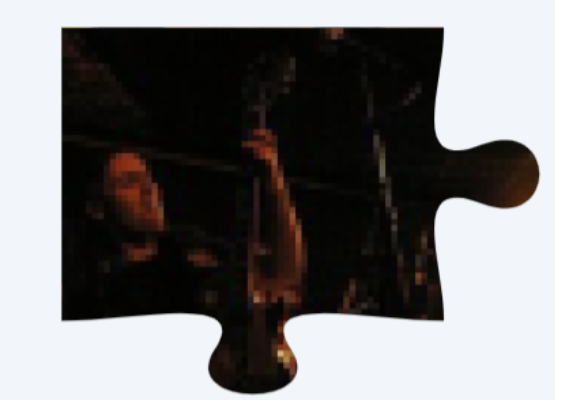
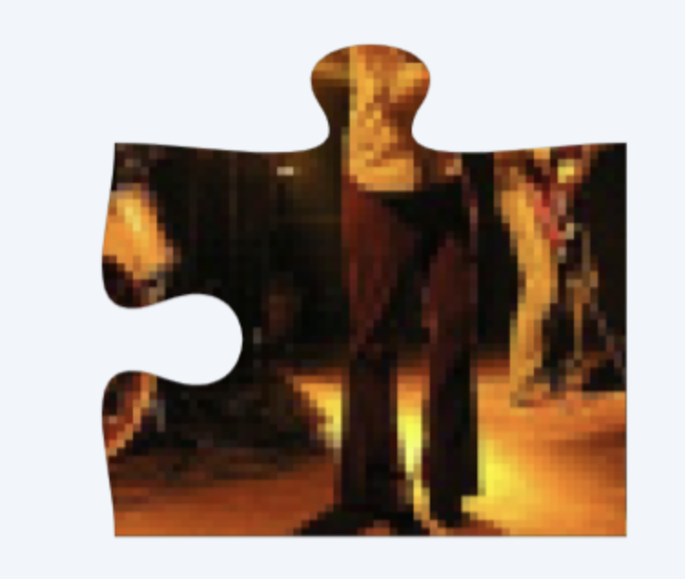
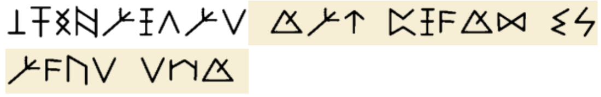
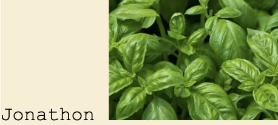
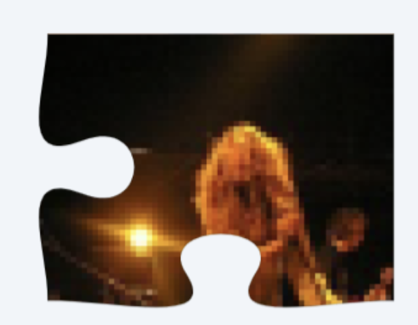
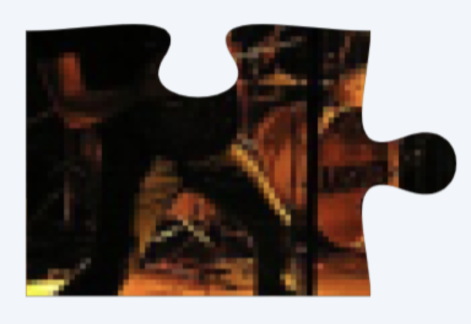

# Level Text
https://www.dropbox.com/scl/fi/uu2zl1iy9lmu49smbh1fk/encryptid.wav?rlkey=6oyfrjothv048dmalyglidjgg&st=cvki3rhy&dl=0 

## Answer
hampton

## Walkthrough
* Clue for ABP Audio decoder in title of audio
* This audio will decode to 3S5xIIE using ABP audio cipher
* This is a bitly backlink: https://bit.ly/3S5xIIE from whichw e get a google doc
* Google doc has base 64 of an image which is the first puzzle piece
    
* The text is enigma machine which after decoding will give **BULLETPROOFBOYSCOUT** which is the fullform translation of BTS
* After deciphering the hexahue we get **ANGLE.LANES.FRAGMENT**
* It is what3words for Gangnam station in Seoul
* Combining Gangnam and BTS you will get a restaurant that BTS used to visit when they were trainees which is **Yoojung Sikdang**
* The number of Yoojung Sikdang is _025114592_ 
* Entering this in the website's terminal, it will echo the link for the second part of the puzzle
https://www.dropbox.com/scl/fi/ffmfqvm38e88wsigequ3z/puzzlepiece4.png?rlkey=u0s53r1l0l23fqhfwrwm4pzcm&st=geusjrey&dl=0 
    
* After inspecting the source of the above page you will get - 
    
    which is a gravity falls rune cipher
* After decoding that you will get
    > swofaqdau tan cqptk vmapju uyt
* After decrypting that using beaufort cipher german variant that you will get **"campeones del mundo twenty six"**
* This means champion of the world and is used in football 
* The champion of the world is spain in 2026 
* Spain will lead  to lelagoon as his bio has the quotes of fc barcelona which is the football club of spain
* The PFP of Lelagoon is Jay Walker 
* The voice actor of jay walker from Ninjago is **Michael Adamthwaite**
* /michaeladamthwaite is a backlink on the main website
* the backlink will give - qllf10.txt and 
    > 1e57ex1cancedtjm2ly540ymbpuww13a1kxckohja83w8dokqnxe3a8ev7119tog34yrvi9rlvt35dm3813ka3cj3p6yoglfz3kx9wicgkldaxpmmxf6ypkq8e2gh2yong8e2a1bg2fdosz93aye3togi122iccuj63hv0sbwys5k9nuxsg1u2xdm9e0ze81j544f51yusg49fgp30bed9416aqoxhm7ryp96u0uz389x0psh294qcbei3r1vm520quv55zh9i9k3ln46mp2udzzftiaf6lltx4mg518px4spvjd0oavhqjq8qwkw47o37j88vs2htu42uefzu2fqvvi04lnh6oir8zx4iqems7njarzysgg8m2c07bom2gs4mc1chii9mcx2ddhs368gb3kzgu8u7ji0bqfpe0w5qu4dsg0ojo598eq8a0m6f49uj1fp1lefitj9ki03s395m2g0j4kw7v9s81br6f20l19qpdo3h6b9ctx7xti2g8md83wec151h757d7knw8fpr2mh1rrvxy4mzy1y9j80c37a0hkj039pmdyk9xz13sueqhi1yebbqxpg7ohrnsx4vp846qm7hoc2hqfxue5m5u36hs8yxq8jnxx4cr0d2lzt9nzxfxast20i33wovausx7byzkqfwizmdudab0l8kvtix2yy6z7shzf7tqrf3ethmr91zd12no94lbu0kn1m8ilw9g701u0viqv0z1gxa8mfsy53bz1ki1ac0nrvh9exwmxdegyff6mbs100om0zno81hb7fmzu45axibhycj3j7l9t4c6i7aj9z5dke7wg3xmwgiiriw0nnp4tu6egc5xc4x1vtxa1mbih0ihq1f366q71vc9j4dvctzrwosadqdr07w1fznp6hje0b97astqvkdhx4d4iumix2gp1vuvhi0v9frsoc5hzito6pwyvyr0qfio6aiv72ov406sze9bg6oq5ci7b5ssjc8i6kw75aet794rk51lzfsvjacqhek3p6korhrwf6d55i0hnukxqxof1789eu8evj5b6bxx4eao35uyffjuy3wbvdwrllf2b3rvqyvpqaug8q3xhsi4reuyz2sw7xg8h4qgyubhxr1llco0c2pcrswt0zbsdivyg9c65y04s7u10tmcpb8xkk5y5l5svy9bbqcmuskxbmijor0hw3phijeut73ie5895hia4bckw5p2s8549ua4e501xttpcrk48ey0yxienhzti21f96el1la13u6sv7tdbeh1bx13p0768yqd2ds18bk18c21dl9262wigg9gfrkok611z6ojoyyv3psom9hnw03rt7s81jq87k6jem3njdb67cj4qu5p3vr29zx9yexceoxecf2soktzpxzhhty8ivex20nmy0pyrwbklyuqj09kuizcy0rd07d07mv1le4hiiaudkh4b0g10bxq22111zfsdzgvfu2k5bdcfytaa12plejijxfqw46dlhji6mom8hm8tek5ziyikpsnmiaoa59fyj50yewvs58btz7fkkw1paf83ofmk9c777cq68on9jgp1a400mdq60oecgibxcwckzdh2cc03tk8bzwnw7kty79q3jii9vpw0y0rigrt2gs2d5cibeeo2yb508wz8b7ay8fmyougiduyk4a504yru91v25m0rwmjnuc9s0aat1lskmhssb75gnmrn436jjs766ocabdt680v68xpash92rm18r83ojg272yz98tgm97ixlcr3yfanxw20jdgss49jxrjm3p6rfvtgd2qrzz9lfe58tkbvpy6jip34y4ybmoz4xi5kx9tjp9gpdc2pm507zrlrxliy1iudcvzayugkr97mdhawnqxvzr6nby9uea5zkrjteogifa3ib25qcwucpaccnaku07c712rfegsxgkx3brjtdp5b2yckx4jhvrn0c4lxou9gnfty4yfzy5lsifw00qswcezbvt1r8p718lcnptied7nwchla771g8yfbw5t5ctc6gms1ldy8jf75b1s1m7lzt476yf28yi0e0lv2pi5vb3qpkjl88sg27hm929wg8lencpsi9m4fil600y5hkqiopzfxqqhat2s4spyf0d0944jclau6c85flw8yjty6zd01x4kb5ssyvwr2wfim3sdmfneags2ipxirp596e7qn4dncwu8zumwj1xy07c021lynu6jxnh859422yu87r6misly2kbyezw1xi0b1ikfrcpljqitx1q944fjkfhhlnh407baxkx29ngn7oed5dxmuz57zhapl2hyrxga5p6o217ursnwfrtfwz7e203ztpnmoh2i7o709iq92yp9aj7oec62m9a02o6p0wob3n8238rs53h7aqcdxdf0fxxb8tz7dgwayxkcbvun9jwuurf8pty7hwv2h5e3fktj2xpme8z9smqmi80fys4ep52ser2kucqzppjjkiyc5m8uzr35erusv1gsmnjgac3tjd97i1675h294xfgy40hto8v4gkfrzbz5nu41j0pqtb1173yl28s3ockjnidv9iaj10m6ui6p8mixj09wkuum9llwhbb1rbi3i3cql8mzq27cwvg645u8db1783ivdw9jkjpiqq7xctbvqf2gvfpmh161tf6gwyr4szu11x6nczy3auexhbns1hpwilg7n9np1spsmue8nsmmea162cfbsfng0g9u1w9yj00gisnkabaxrhb667hnqv1bg9ya0pdfapbdoj2k2zov9baxm4zfszhpd7ztcsyhza308vvbz7orvurh1cxov9jv9w9khmmjklsk0ila0yfbrfcnr6huobkzrte2i25uermzicl39dm1c31otbptxrs4ll4ka3fqudfktcuzdvh00vwz4ib4ji3r7x51te1tj75yhzd2mpwt6xjo9mqmjftt6ge0lhb87482jnn7afump49nxug6j4cm9j1xiddzhq0jd9f0f2o0dwxjg43zngxfjrzmxs0lzk4tpsv2dl1u77oboyty5mcnbklvnbsuskp627mas0wes8oo4vtdfocwgqhepwxgnj153i05t5gbkuwaefi6vgsqt7zbmvnsrzql9d9qb67d8v6fylbgkv8wwt2r0eoz1cv6dr52nyg9c9dho3yxdtzsf10fzd4udznv8tjx6pbjh2fujemadwmx7segyofk1ydbemb1s20e4nqrr4fvna
    
    > Volume 17: Shelf 5 :Wall 1 page-2_
    
* qllf10.txt is a catbox backlink you will have to save as a png to get the image
    
* The image from /michaeladamwithe  and the name will give  jonathan basile who is the developer of library of babel
* The rest are coordinates for the location of the page
* In the page you will get
    > jangan pernah mengalahwalau dalam susahkau teruslah melangkahdengan tabah  
* These are the lyrics for the song - As’ad motawh
* Search the official video of this song on youtube 
* From checking comments you will get - hw9My9gQ
* This is a pastebin backlink
* From the paste you will get ROT-47
* Decoding it you will get [link to last part of puzzle](https://www.dropbox.com/scl/fi/o6sxueaamx9eisc624jz1/NBA.png?rlkey=jctvf7oh1n4gox9d6oedsn6w2&st=0woe2wky&dl=0) which has title "NBA"
    
* After joining pieces and searching on google you will get the band - The Answer
* After searching The Answer + NBA you will get that it is also the nickname of Allen Iverson 
* The birthplace of Allen Iverson is hampton which is the answer

