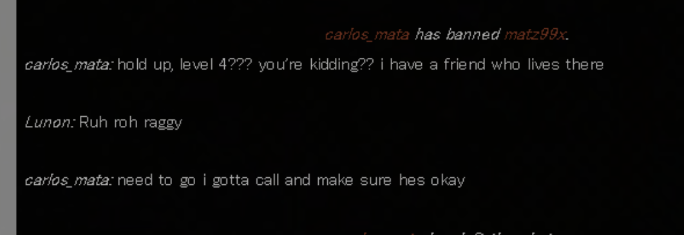
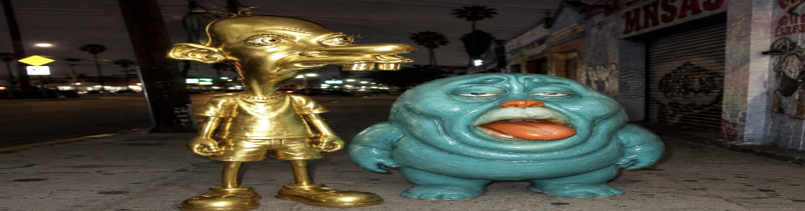

# Level Text
https://docs.google.com/document/d/1zV-_RTjR27A_Y-N8bJJn2OVxc_GN7TTPhraOK_7ZM3s/edit?tab=t.0

## Answer
lookitsrobertloggia

## Walkthrough
* Title is palindrome, text is reversed base64, reverse it again and convert base64 to image
* Image is stegged using futureboy which gives
    > What's the best first-person shooter about genetically modified super soldiers? 
* From this, we get "**halo**"
* When we enter "halo" on the terminal, we get
    > Ever since matz99x got banned entity 40 ki to networking mei back laggyi he got backloggd
* When we search "Entity 40 Back Networking", we get https://backrooms.fandom.com/wiki/Entity_40
* Looking for matz99x on this webpage you find
    
* Our friend from [level 4](https://github.com/techsyndicate/encryptid-26-writeups/blob/main/cryptic/level4/writeup.md) is Allen Iverson
* Backloggd + Allen Iverson we get https://backloggd.com/u/alleniverson
* On his journal you find that he's started a game on 14 October 1993 and finished it on 10 September 2025
* These days coincide with birth and death date of charlie kirk
* Backlink /charliekirk on the website gets you [drive link](https://drive.google.com/file/d/1lGzYFbPhyOHDb67U04Da_6CsXNwYUoU3/view?usp=sharing)
* On playing this game you find image of **Neegy** and **Funky Ehh** chasing you in the backrooms
    
* When we enter Neegy on the hunt website's internet explorer, we get an image of **mrwhosetheboss**
* When we enter Funky Ehh on the hunt website's internet explorer, we get an image of **an infant**
* The Audio playing in the game is [**Niche Chinese Babies**](https://www.youtube.com/watch?v=S7BeQ1i3t-Y)
* Opening it's youtube video, we get a comment “who’s it’s competitor”
* Youtube channel has description “find me // from meme I came, to memes I return // I am become meme, rotter of brains”
* Elon musk said “i am become meme”
* Elon Musk gives X
* Competitor of X is Instagram
* Looking at mrwhosetheboss on instagram you get photo of his newborn child
* Looking through comments you find “mrwhosthefather”
* Searching mrwhosethefather on youtube give you another [youtube channel](https://www.youtube.com/@mrwhosethefather/videos)
* This youtube channel has different shorts and videos in which the captions have one letter of a backlink
* The order of the backlink is given in the titles of the videos translated in different languages
* We get the backlink 4-ohJ6oXGkI
* It is the backlink of a [youtube video](https://www.youtube.com/watch?v=4-ohJ6oXGkI)
* Youtube video has comment "L as in"
* In the video, he says L as in robert loggia => Answer

*Writeup written by Jai Dugal*