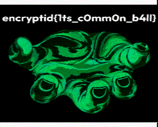

# Crazy Crook

## Challenge Info

**Category:** Forensics   
**Points:** 250   
**Challenge Description:**

```
A while back, a crazy crook sealed the secret message into fragments and locked it away behind fragile encryption. Luckily you found the archive, but the password remains a mystery. Though there have been rumors that something appears leaky...
```

## Recon

Download and list the outer archive:

```bash
$ unzip -l crazy-crook.zip
  Length      Date    Time    Name
---------  ---------- -----   ----
      202  2026-08-15 17:25   part_5.zip
      202  2026-08-15 17:25   part_6.zip
      ...
      202  2026-08-15 17:25   part_1.zip
      202  2026-08-15 17:25   part_2.zip
---------                     -------
     4440                     22 files

$ mkdir /tmp/crook && unzip -o crazy-crook.zip -d /tmp/crook
```

Each inner archive contains one stored file:

```bash
$ unzip -l /tmp/crook/part_1.zip
  Length      Date    Time    Name
---------  ---------- -----   ----
        4  2026-08-15 17:09   part_1.txt

$ python3 << 'PY'
import glob
import zipfile

for f in sorted(glob.glob("/tmp/crook/part_*.zip")):
    info = zipfile.ZipFile(f).infolist()[0]
    print(f"{f}: {info.CRC:08x} size={info.file_size} method={info.compress_type} flag={info.flag_bits:x}")
PY
part_1.zip: 97780db2 size=4 method=0 flag=9
part_2.zip: c8ffb51c size=4 method=0 flag=9
...
part_21.zip: 6971a02d size=2 method=0 flag=9

$ xxd /tmp/crook/part_1.zip | head
00000000: 504b 0304 0a00 0900 0000 ecb4 0f5d b20d  PK...........]..
00000010: 7897 1000 0000 0400 0000 0a00 1c00 7061  x.............pa
                 ^^^^  # 0x0009 = 0x0001 (encrypted) | 0x0008 (data descriptor)
```

CRC-32 (IEEE 802.3 used in ZIP, Ethernet, gzip and PNG) has:

* width 32
* poly `04C11DB7`/`EDB88320` (normal/reversed)
* init `FFFFFFFF`
* refin/refout true
* xorout `FFFFFFFF`
* check `CBF43926`

ZIP stores this final value unencrypted in both the Local File Header and Central Directory even when the file data is encrypted.

Here the leak is simpler. At `crazy-crook.zip` the flag `0x09` means encrypted + extra field:

* `compress_type == 0` (`STORED`)
* `flag_bits & 0x1 == 1` ZipCrypto
* `file_size` is `4` (last `2`) and CRC is plaintext

## Exploitation

With `STORED` the file content is stored so the 4 byte plaintext is directly the CRC input. Each fragment is only 4 bytes (2 for the last part) and the alphabet is `string.printable` (100 symbols) so at most `100^4` candidates. The reversed form uses `0xEDB88320` as `crc = (crc >> 8) ^ table[(crc ^ byte) & 0xFF]` with init `0xFFFFFFFF` and final `crc`. Trying (bruteforcing) each candidate against its stored CRC recovers the fragment.

The solve script can be found [here](./solve.py) which gives us: `https://drive.google.com/file/d/1MBt-OHJPGdWSZz668XV0c71vBkqpFqI7`

The recovered wav is an SSTV encoding which is a narrowband mode for transmitting static images over voice channels by reducing the scan rate the ~3 MHz bandwidth of broadcast television is compressed into ~3 kHz for SSB transmission on amateur bands.

Decoding with [sstv-decoder.mathieurenaud.fr](https://sstv-decoder.mathieurenaud.fr/) gives the 

## Flag

```
encryptid{1ts_c0mm0n_b4ll}
```

*Writeup written by Ayush Sharma*
