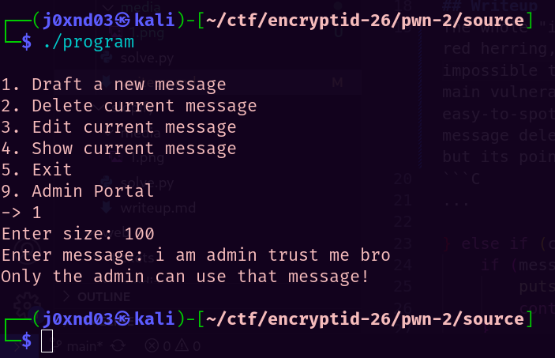

# Pigeon
## Challenge Info

**Category:** Binary Exploitation   
**Points:** 500   
**Challenge Description:**
```
Say hello to Pigeon, the future's messaging app! Send me new, fresh updates of your life, or anything in general. Don't try to pretend like you're the admin though, I know you're not!

Connect with nc 20.219.0.137 3001.
```

## Recon
The challenge is a netcat service that allows us to draft **one message** and manage it. It also has an **Admin Portal** that we're not allowed to access. We can only get into the Admin Portal if the content of our message is `i am admin trust me bro`, but putting that in the message is strictly forbidden.



## Writeup
The whole "i am admin trust me bro" path is a red herring, because it is quite literally impossible to forge that message somehow. The main vulnerability in the challenge is an easy-to-spot **Use After Free (UAF)** in the message deletion. The message chunk is freed, but its pointer reference is not nulled. 
```C
...

} else if (choice == 2) {
    if (message == (char *)0x0) {
        puts("You don't have a message yet!");
        continue;
    }
    if (is_free == 1) {
        puts("Double free detected!");
        exit(1);
    }
    free(message);
    is_free = 1;
    puts("Message deleted successfully.");
}

...
```

However, we can't produce any substantial leaks using this double free. This is because the only leak we can potentially get is a heap address, but for RCE, we also need a PIE and LIBC leak which we can't get through this.

We can, though, use the UAF to our advantage. We know that when option 9 is used (Admin Portal), the program calls `fopen("flag.txt", "r")`:

```C
...

} else if (choice == 9) {
    FILE* fptr = fopen("./flag.txt", "r");
    if (fptr == NULL) {
        puts("Error reading flag file. Please contact mods.");
        exit(1);
    }
    if (message == (char*)0x0) {
        puts("You haven't created your message yet!");
        continue;
    }
    if (strcmp(message, admin_message) == 0) {
        char buf[FLAG_SIZE];
        fread(buf, 1, FLAG_SIZE-1, fptr);
        buf[FLAG_SIZE - 1] = 0;
        puts("Welcome, admin.");
        printf("Here's your reward: ");
        puts(buf);
    } else {
        puts("Denied.");
        continue;
    }
}

...
```

`fopen` allocates a `struct FILE` object on the heap. Since we control the size class of the message chunks that we allocate, we can create one in such a way that it has the same class as the `struct FILE` (for example, `malloc(0x1d0)` produces a chunk of the same size class). Then, if we `free()` our message object and reproduce the Use After Free, the FILE object reuses our freed chunk, and we can freely read or write through its metadata fields.

After that, we use a standard FSOP technique like **House of Apple 2** to pop a shell when the program exits. It works because on exit, glibc tries to close all currently open files. Since the corrupted FILE struct also counts as a struct for an open file, we can manipulate its fields in many ways such that if glibc tries to close it, it pops a shell instead. To know more about House of Apple 2, [read this](https://jia.je/ctf-writeups/2025-09-07-blackhat-mea-ctf-quals-2025/file101.html).

The solve script can be found [here](./solve.py).

## Flag
```
encryptid{ch0mp_541d_7h3_p1g30n_45_h3_g4v3_y0u_7h3_fl4g}
```

*Writeup written by Shyamak Seth*