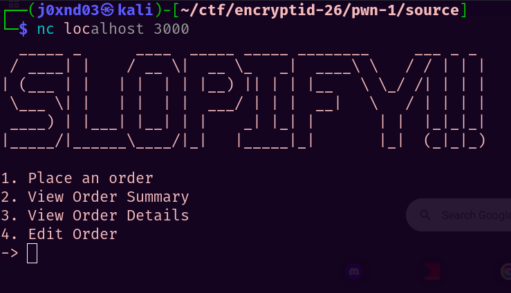

# Slopify
## Challenge Info

**Category:** Binary Exploitation   
**Points:** 250   
**Challenge Description:**
```
I slopped a slop version of Shopify, and used my absolute genius to give birth to the all new SLOPIFY!! I can't bother to check for any vulnerabilities though.

Connect with nc 20.219.0.137 3000.
```

## Recon
We've been given a netcat instance of a service that allows us to place and manage orders:



All these menu options are basic functionalities for managing orders. We observe the following things for each menu option:

1. **Place An Order** asks us for the quantity of the order, the order details, and also asks us to create a new PIN for it.
2. **View Order Summary** asks us for the order ID (goes from 0 to 7), and returns the Order ID and the Quantity for the order related to it.
3. **View Order Details** asks us for the Order ID and returns the order details that we specified while placing the order.
4. **Edit Order** allows us to edit the **order details** of a specific order.

## Vulnerabilities
There is a limit of 8 orders in the program, and only enough space for 8 orders is created on the stack. Orders are stored as individual structs on the stack, defined as:

```c
typedef struct {
    char* details;
    int order_id;
    int quantity;
} Order;
```

However, whenever the orders are referenced in the menu options, it is never checked if the order ID does not lie in the range of 0 to 7, which is assumed by the program. It allows us to access **Out-Of-Bounds Memory** if we specify a negative order ID, or one greater than 7. For example:

```C
...

} else if (choice == 4) {
    printf("Enter Order ID: ");
    if (scanf("%d", &input) != 1) {
        puts("Input error");
        exit(1);
    }
    getchar();
    printf("Enter new details: ");
    fgets(orders[input].details, 80, stdin);
    // the "orders" array is referenced without checking if 0 <= input <= 7
}

...
```

Another interesting thing to note is this function:

```C
void secret() {
    puts("HMMMM...");
    system("/bin/sh");
    return;
}
```

We can thus use the Out Of Bounds vulnerability to somehow run this function, which freely gives us a shell! To do this, we can implement the following:

1. Leak a binary address from the stack by specifying an order ID > 7 in the **View Order Summary** option (the two numbers that it returns are simply the lower 4 and higher 4 bytes of the address). You can debug the binary using GDB to find that Order ID = 11 leaks the address of the `main` function.   

2. Using this address, calculate the base of the binary, therefore defeating PIE. Then, use fixed offsets to calculate the runtime address of the `secret` function.

3. We now need to overwrite the GOT address of a function with the calculated address of `secret`, so that calling that function indirectly calls the secret function. To do this, we need to craft a pointer to a GOT entry of a function, say, the `exit` function, on the stack. We make use of the `pins` array for this, which stores all the order pins, 4 bytes each. Put the lower 4 and higher 4 bytes of the GOT address as two different pins for two different orders.

4. We know that the `pins` array lies before the `orders` array in memory. So, by putting a negative number as the Order ID, the pins are referenced. Use the **Edit Order Details** option with a negative Order ID (in our exploit code, it is -2) to dereference our crafted pointer (to exit@GOT), and overwrite its memory with the address of `secret`.

5. Simply put an invalid choice in the menu, like `x`, which calls `exit()`, ultimately forcing a call to `secret()`, getting a shell!

You can check out the exploit [here](./solve.py).

## Flag
```
encryptid{0h_50_y0u_kn0w_pwn}
```

*Writeup written by Shyamak Seth*
