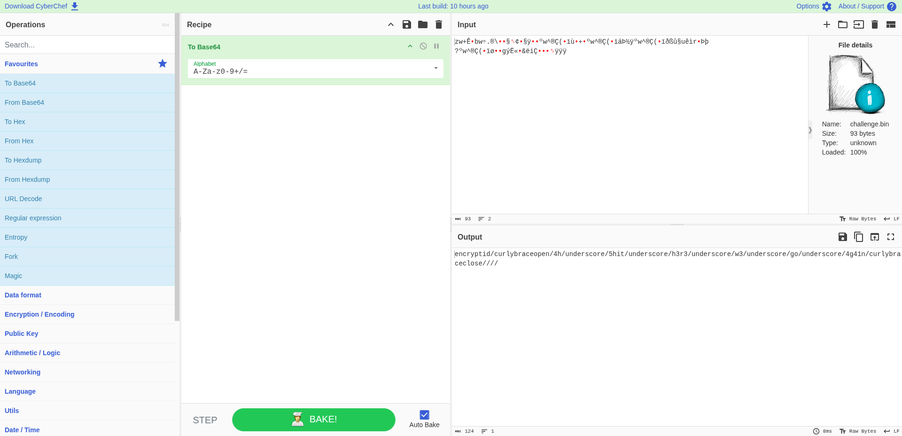

# Slopify
## Challenge Info

**Category:** Miscellaneous   
**Points:** 250   
**Challenge Description:**
```
Have you ever gone to sixty fourth base with someone before?
```

## Writeup
We're provided with a binary file, `challenge.bin`, which contains some random unreadable data. There is nothing we can make of this file, despite performing many standard checks on it (binwalk, steg, etc.)

However, the challenge description points us to **Base 64**. Clearly the data is not base64 encoded, because that is supposed to be readable. Then could it be... base64 decoded?

Putting the binary file on CyberChef with the `To Base64` Operation gives:



We may then format the flag accordingly to get...

## Flag
```
encryptid{4h_5hit_h3r3_w3_go_4g41n}
```

*Writeup written by Shyamak Seth*
