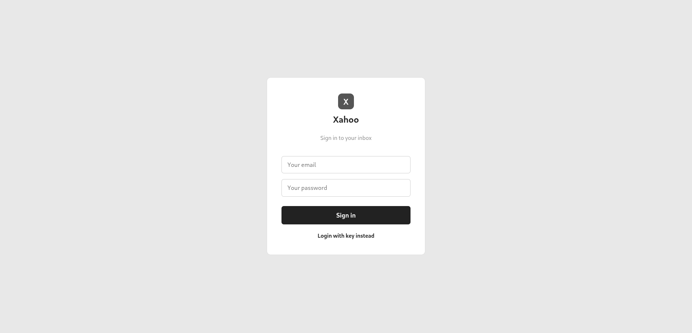
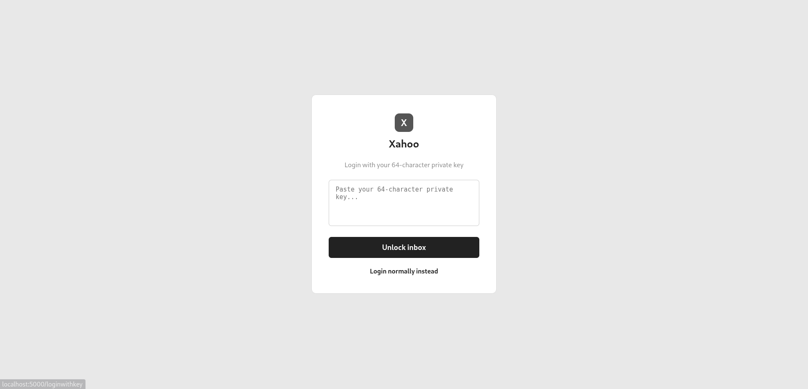
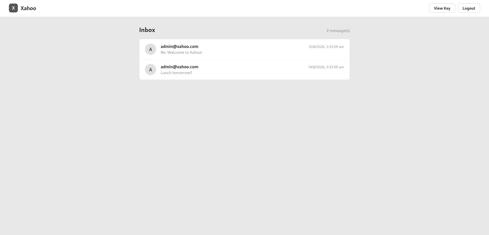
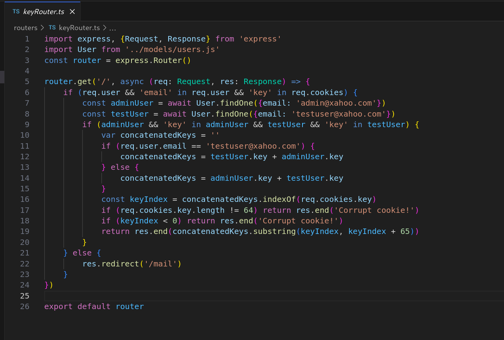
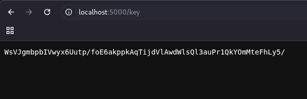
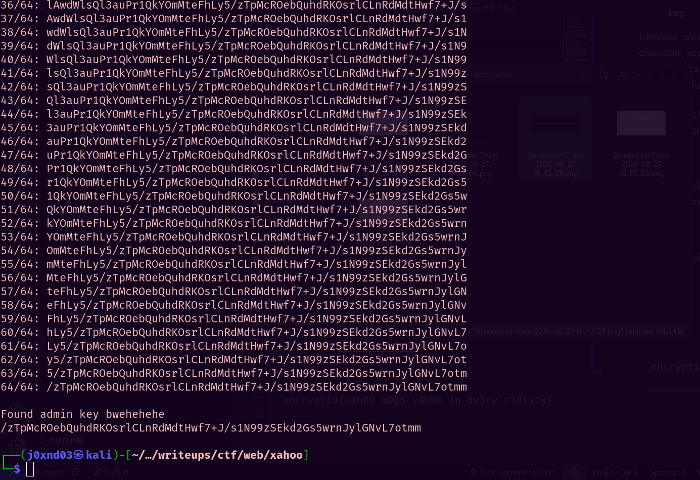
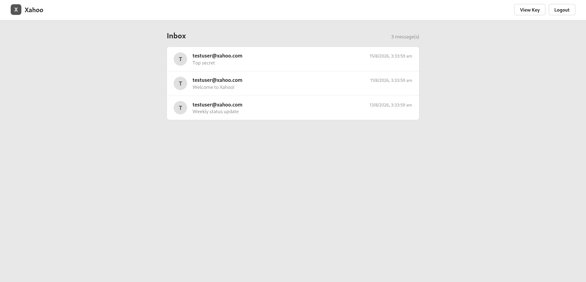
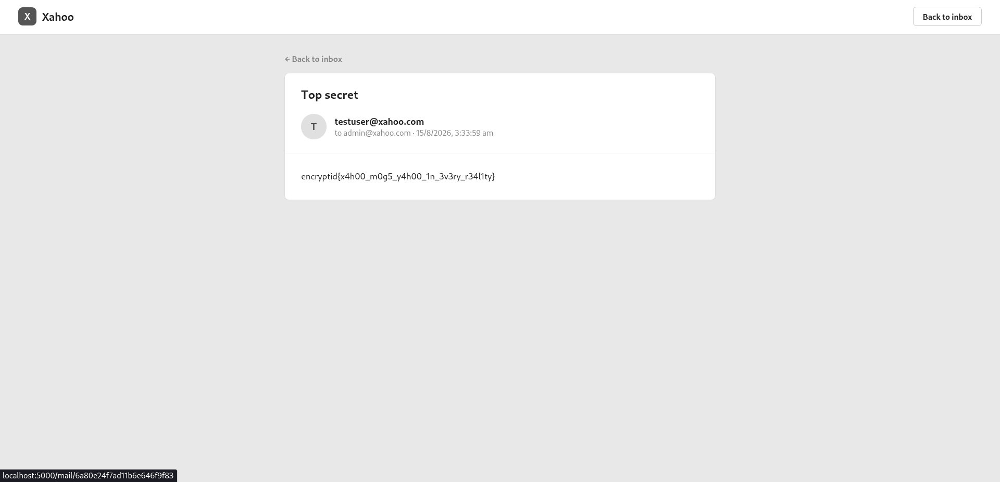

# Xahoo
## Challenge Info

**Category:** Web Exploitation   
**Points:** 250   
**Challenge Description:**
```
No one uses Yahoo anymore, so I switched to Xahoo. https://xahoo.onrender.com. 

Test Key: WsVJgmbpbIVwyx6Uutp/foE6akppkAqTijdVlAwdWlsQl3auPr1QkYOmMteFhLy5
```

## Recon
We've been provided with a website, along with its source code written in Node JS. It seems to be a mailing service that is an alternative for Yahoo Mail, hence the name Xahoo. There are two ways to login to the service: using the account's email and password, or using a "key" associated with the account.   




Since we have been given the key of the starter account, let's use that to login and see if we find anything interesting.



As you can see, there are only two emails sent from an admin account to us. We now know that an admin account exists on the website, and somehow logging in to that account's inbox might get us the flag. Also, the "View Key" option on the top right simply takes us to a page that displays our private key.

## Vulnerabilities
Let us analyze how the "View Key" endpoint works, since its working seems to be very unique (and counter-intuitive).



Essentially, it takes the key of testuser (which is our user) and concatenates it with admin’s key (which is the user whose inbox we want to login to).

After concatenating them, it performs some checks:
1. It checks if the length of the `key` cookie is 64. If not, then it throws an error.
2. It checks if the value of the `key` cookie is included in the concatenated keys string. If not, then it throws the same error.
3. If both of these conditions pass, then it extracts the value of the `key` cookie from the concatenated string, and sends it as a response.

**But wait!** There’s a bug in this. When it extracts the value of the key cookie from the concatenated string, it actually sends back **65 characters** of the concatenated string, when the key is actually 64-characters long! This means that if we put our key in the key cookie (which, if you notice, is present by default), going to the key page will give us **one extra character**. That extra character is, indeed, the first character of the admin's key! To confirm this, you can check the length of the key returned by the /key endpoint. You’ll find that it is 65 characters long.



Now consider this: what if we change the value of the key cookie, such that we exclude the first character of our key, and instead append the first character of admin’s key at the end of the cookie? All the checks will be passed:
1. The length of our cookie is 64 characters.
2. The substring is, indeed, present in the concatenated key string.
3. As a result, the program will give us back the character after the 64-byte sequence we have provided. That character will be the **second character of the admin’s key**.

Likewise, we can repeat this process 64 times: remove the first character, append the extra character in the end, until we reach the last character of the admin’s key. By then, we will have exfiltrated the entire key!

To automate this, we may create a script. You can find it [here](./solve.py). The output gives us the admin key:



We can then login using this key, and successfully login to the admin's inbox!



The first email contains the flag:



## Flag
```
encryptid{x4h00_m0g5_y4h00_1n_3v3ry_r34l1ty}
```

*Writeup written by Shyamak Seth*