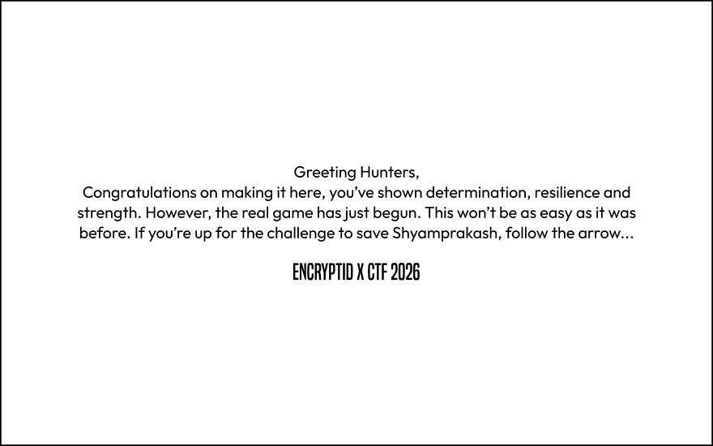
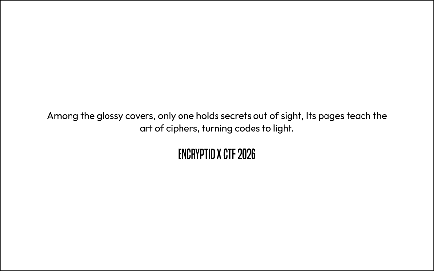
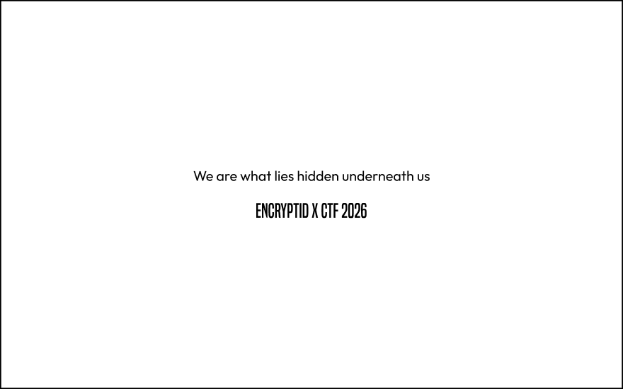
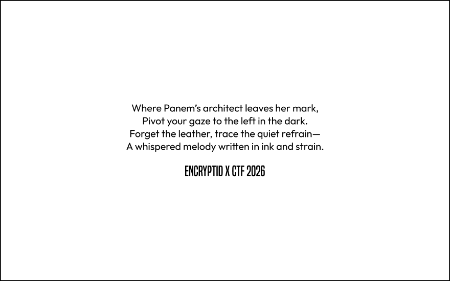

# Offline Encryptid Level

## Challenge Info

**Category**: dude how do i put this into words   
**Points**: ∞

## Theme
The offline level is an **Escape Room** challenge. You are taken to the School Library, in which all lights are dimmed and an environment is set up. The goal is to find **Shyam Prakash**, the penguin mascot of Tech Syndicate, sitting outside the **Exit Door**, and escape out of the room with him. However, the exit door has been locked. Your job is to unlock this door and escape.

## Rules
1. What happens in the room, stays in the room.
2. You are given a maximum **20 minutes** to solve the level. Points are given based on how far you reached in the level. Finishing the level before time gives you more of an advantage.
3. Leads are given throughout the level to guide you, but only **2 substantial hints** are allowed for free at any point of time during the level. Apart from these, 3 more hints can be taken, but these cause increasing penalties in points.
4. You are allowed to take your phones into the room. Google Search and basic phone functionality are allowed, but usage of AI like Google Lens, Chatbots, etc. is strictly forbidden.

## Walkthrough
On entering the room, you are given **2 envelopes** with starter clues in them:

   


An arrow board is set up right in front of you, that points to the left. Going there takes you to an entire square section of the library. Notice how the second envelope mentions "glossy covers". This refers to the **magazines rack** in that section. Here, one book is out of place: **"The Code Book"** (*its pages teach the art of ciphers*).

Picking up the book reveals another envelope hidden behind it, with another message inside:



This hints at something hidden underneath the rack on which the book was kept. You play around a little with the shelf, and as it turns out, that entire row can be pulled up and a hidden compartment is revealed inside it. In this compartment, you find a visual printout of **a clock**.

It leads you to the clock hanging on the wall. You realize that the clock is not working, and is stuck at a particular time, **8:19**. This is important, because in this section of the library, right in the middle, there is a **large suitcase**, but it is protected by a numerical lock. The passcode to that lock is **819**.

Inside the suitcase, you find a new envelope with another message inside it.



You now get out of the square section of the library, because the first cryptic clue in the message points to **Suzanne Collins**. Looking around in the library, you find a large banner with her face on it, and other works of her. This is where the second clue of the message comes in: *"a whispered melody written in ink and stain"*. **Sheet music!**

Right in front of the Suzanne Collins banner, you find a stand with some sheet music kept on it. It shows **Spring** from **The Four Seasons** by **Antonio Vivaldi**. You also find a weird looking pen kept on the stand, which has a switch. When you turn it on, blue light comes out of one end of the pen.

Something has been written on the sheet music with invisible ink, and can only be seen in this blue light.


"His first name" means **Antonio**, which will be relevant in a bit. For now, if you turn over the second page of the sheet music, you see this cipher drawn out:


This is a custom implementation of the **Pigpen Cipher** written out manually. It directly decodes to: 

```
TO BE OR NOT TO BE
--> AUTHOR?
```

As we know, "To be or not to be" is a line from Hamlet, which was authored by **William Shakespeare**. So, we now need to connect William Shakespeare and Antonio together. This leads us to the book, **The Merchant Of Venice**, written by Shakespeare, whose main character is Antonio. 

The next step is to find this book in the library. There are many books, so the best way is to follow the Dewey Decimal System guides stuck throughout the library. The book is racked in a shelf in the opposite far end of the library.

Once you find it, right underneath the book, you find this little note:


The first three numbers are coordinates for the **Book Cipher**: Page Number, Line, and Word. Going to the specified coordinates gives you the word **"Balthasar"**. The second clue in the note tells you to "go to the laptop". Right on the other side of the shelf, you find a table with an open laptop on it. A website is displayed on it.

TO BE CONTINUED
